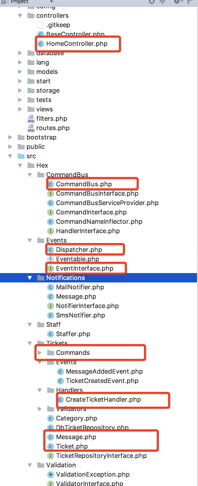

## 分析的项目： 
https://github.com/fideloper/hexagonal-php

## 目录：

## 项目分析概要：
- controller 是入口，属于**适配器**，controller 创建 Command （数据传输对象），并传递给CommandBus，并最终传递给 CommandHandler；
- CommandHandler 属于领域服务（或应用服务），对外提供端口，是内层（业务领域层的对外边缘）；
- CommandBus 属于 Command 调度器（委派）；
- CommandHandler 管理协调实体类去执行具体的业务逻辑，并发布领域事件，使用仓储管理实体对象。Handler 体现（定义）了六边形架构的**端口**：向其中注入仓储、Command、事件分发器 Dispater 等；
- **实体类**（如 Ticket 等）实现具体的业务逻辑，并产生相应的**领域事件**。注意实体只产生事件，不负责发布事件，发布事件的工作由服务 Handler 完成。
- 总结：
    端口：CommandHandler定义的公共方法（包括构造函数）；
    端口契约：仓储（输出、输入）、事件分发器（输出）、Command（输入）等；
    实体（业务类）：Ticket等；
    适配器：Controller、仓储、分发器；

## 六边形架构的理论概要：
- 重点是：外围（http、api、存储层、事件发布、通知、自动化测试等）不要侵入里层（**业务领域层**），而是以接口的方式注入进去，保证里层的可测试性。如这里的 CommandHandler，注入了仓储、分发器、适配器。另外，业务逻辑通过领域服务（CommandHandler）这个里层边界封装起来，不能泄露到外层，如不能在仓储、分发器、通知、控制器、适配器中写业务逻辑。此处，CommandHandler 这个领域服务是里层对外的公共接口和代言人。
- 在使用六边形架构时，我们应该根据用例来设计应用程序，而不是根据需要支持的客户数目业设计。任何客户都可能向不同的端口发出请求，但是所有的适配器都将使用相同的API。
- 每种类型的客户都有自己的适配器，该适配器用于将客户输入转化为程序内部API所理解的输入（或者反向）。
- 六边形每条不同的边代表了不同种类型的端口，端口要么处理输入，要么处理输出